# 

## Model
www.msaez.io/#/80799702/storming/21be18998d302fa289b30897d2a4c92d

## Before Running Services
### Make sure there is a Kafka server running
```
cd kafka
docker-compose up
```
- Check the Kafka messages:
```
cd infra
docker-compose exec -it kafka /bin/bash
cd /bin
./kafka-console-consumer --bootstrap-server localhost:9092 --topic
```

## Run the backend micro-services
See the README.md files inside the each microservices directory:

- reserve
- movie
- reservelist
- notification


## Run API Gateway (Spring Gateway)
```
cd gateway
mvn spring-boot:run
```

## Test by API
- reserve
```
 http :8088/reserves id="id" userId="userId" reserveStatus="reserveStatus" amount="amount" movieId="movieId" date="date" 
```
- movie
```
 http :8088/movies id="id" stock="stock" movieName="movieName" date="date" 
```
- reservelist
```
```
- notification
```
 http :8088/notifications id="id" reserveId="reserveId" reserveStatus="reserveStatus" userId="userId" 
```


## Run the frontend
```
cd frontend
npm i
npm run serve
```

## Test by UI
Open a browser to localhost:8088

## Required Utilities

- httpie (alternative for curl / POSTMAN) and network utils
```
sudo apt-get update
sudo apt-get install net-tools
sudo apt install iputils-ping
pip install httpie
```

- kubernetes utilities (kubectl)
```
curl -LO "https://dl.k8s.io/release/$(curl -L -s https://dl.k8s.io/release/stable.txt)/bin/linux/amd64/kubectl"
sudo install -o root -g root -m 0755 kubectl /usr/local/bin/kubectl
```

- aws cli (aws)
```
curl "https://awscli.amazonaws.com/awscli-exe-linux-x86_64.zip" -o "awscliv2.zip"
unzip awscliv2.zip
sudo ./aws/install
```

- eksctl 
```
curl --silent --location "https://github.com/weaveworks/eksctl/releases/latest/download/eksctl_$(uname -s)_amd64.tar.gz" | tar xz -C /tmp
sudo mv /tmp/eksctl /usr/local/bin
```

# Table of contents
  -  [서비스 시나리오](#서비스-시나리오)
  -  [Inner Architecture](#Inner-Architecture)
  -  [Envet Storming](#Event-Storming)
  -  [분산 트랜잭션 SAGA](#분산-트랜잭션-SAGA)
  -  [보상처리](#보상처리)
  -  [단일진입점](#단일진입점)
  -  [분산 데이터 프로젝션-CQRS](#분산-데이터-프로젝션-CQRS)
  -  [클라우드 배포 - Container운영](#클라우드-배포-Container운영)
  -  [컨테이너 자동확장 HPA](#컨테이너-자동확장-HPA)
  -  [컨테이너로부터 환경분리 ConfigMap/Secret](#컨테이너로부터-환경분리-ConfigMap/Secret)
  - [클라우드 스토리지 활용 PVC](#클라우드-스토리지-활용-PVC)
  - [셀프힐링/무정지배포 - Liveness/Readness Probe](#셀프힐링/무정지배포-Liveness/Readness-Probe)
  - [서비스메시 응용 - Mesh](#서비스메시-응용-Mesh)
  - [통합모니터링 Loggregation/Monitoring](#통합모니터링-Loggregation/Monitoring)

# 서비스 시나리오

영화 예매하기

1. 고객이 영화를 선택하여 예매한다.
2. 고객이 영화 예매 완료 시 영화 티켓 수가 감소되며 알림 메시지를 발송한다.
3. 고객은 영화 예매를 취소할 수 있다. 영화 예매가 정상적으로 취소되면 영화
티켓 수가 증가되며 알림메시지를 발송한다.
4. 예매하려는 표수보다 영화 티켓수가 적을 경우 예매가 되지 않는다.
5. 영화 예매 리스트를 조회할 수 있다.
6. 영화 예매 상태가 바뀔때마사 카카오톡으로 알림 메시지를 발송한다.
  

# Inner Architecture
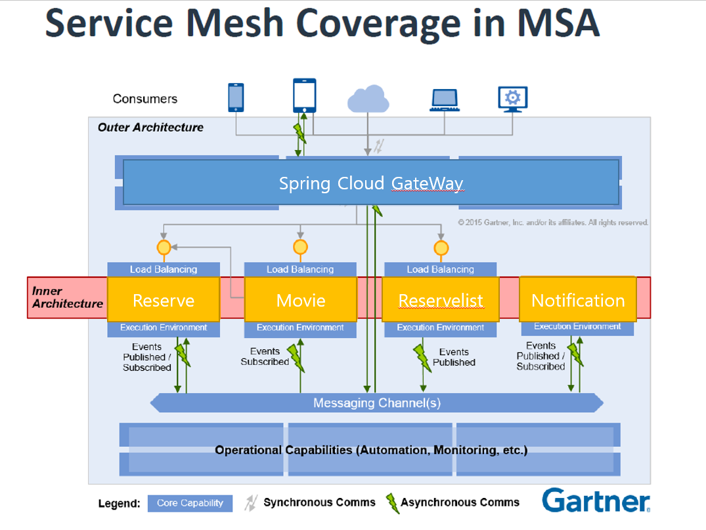

# Event Storming
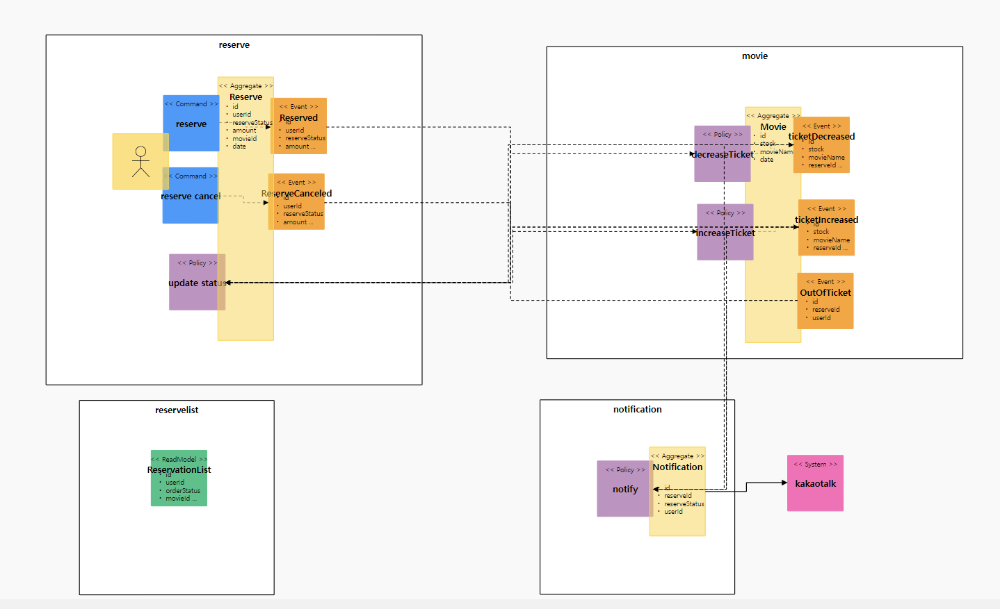

# 분산 트랜잭션 SAGA
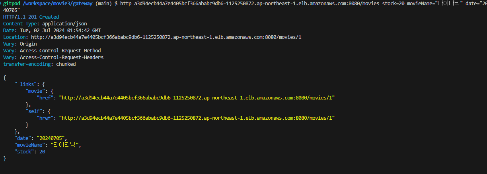

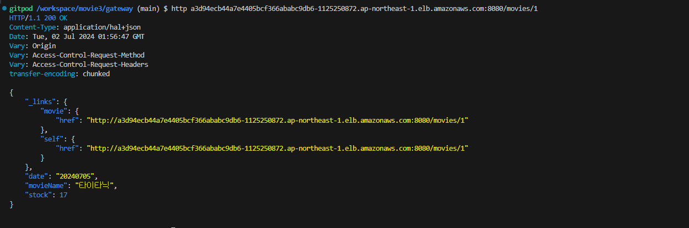
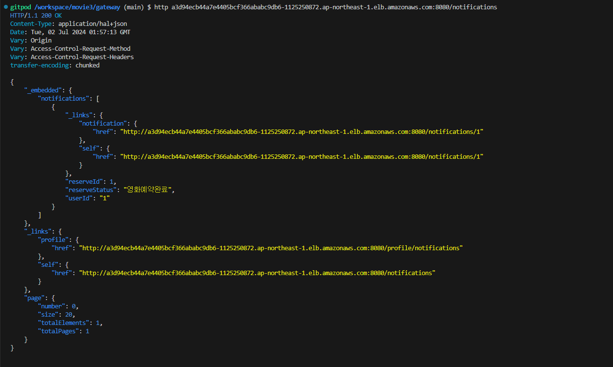 

# 보상처리
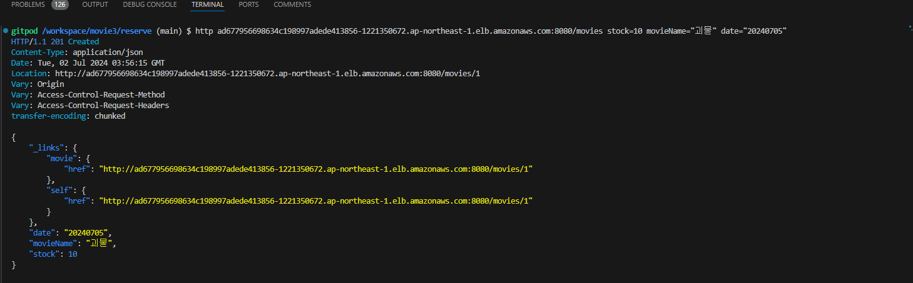 
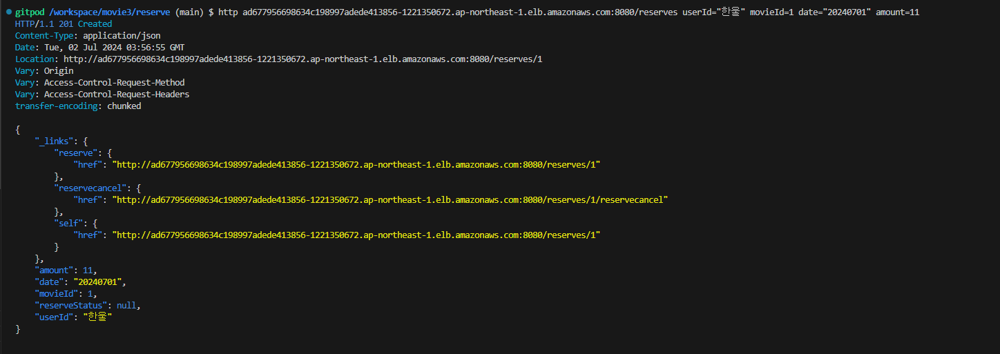 
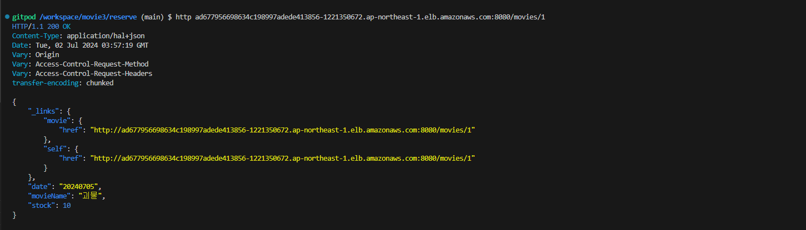 
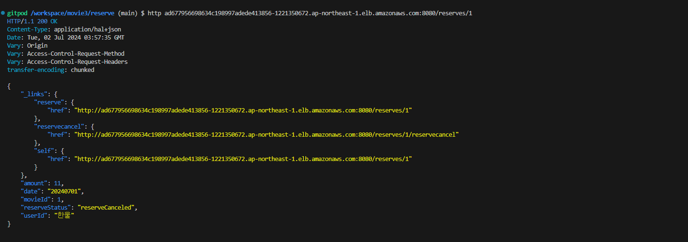 

# 단일진입점


# 분산 데이터 프로젝션 -CQRS
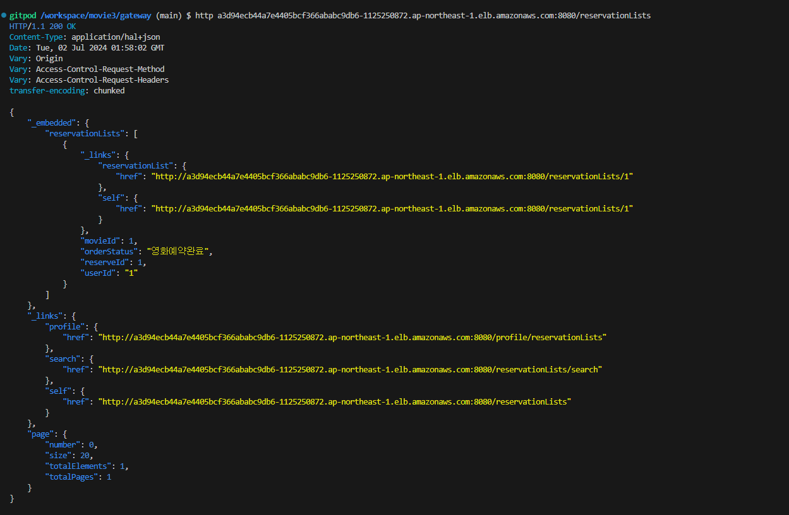

# 클라우드 배포 - Container운영

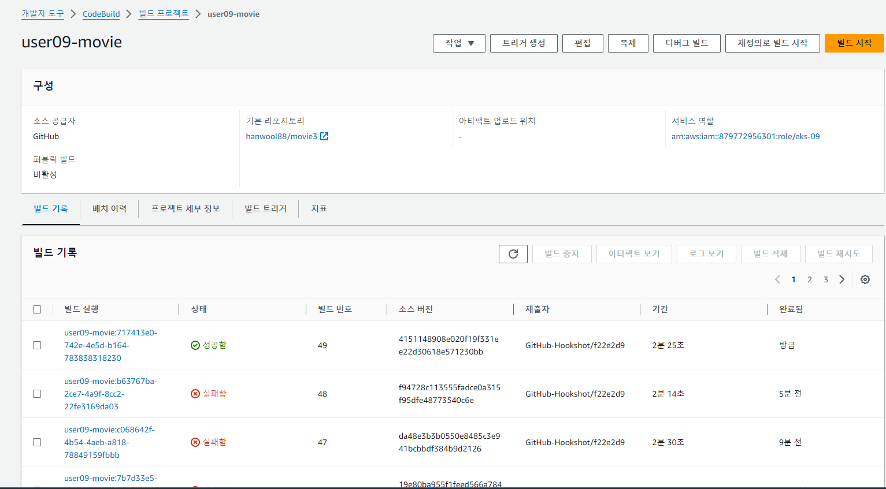
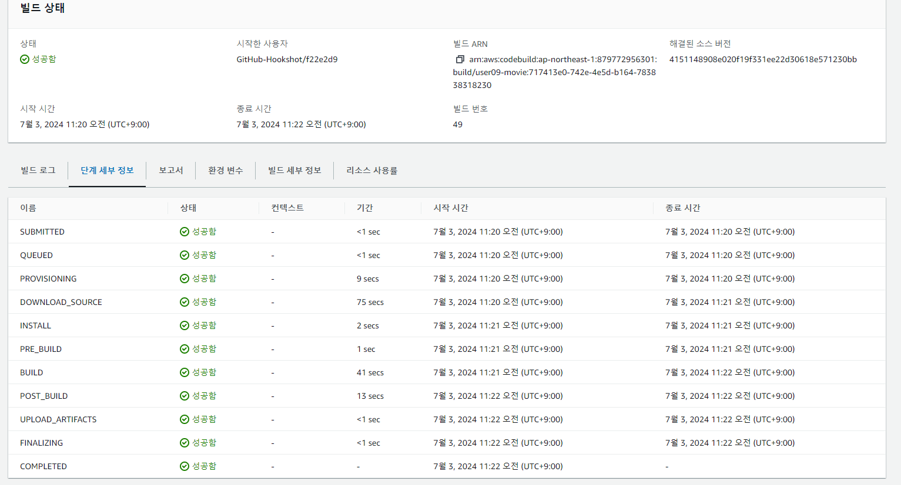

# 컨테이너 자동확장 HPA
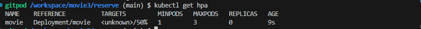
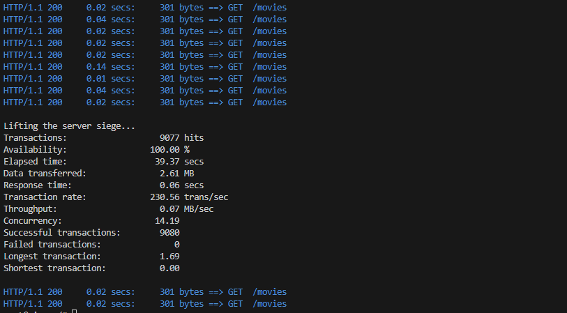
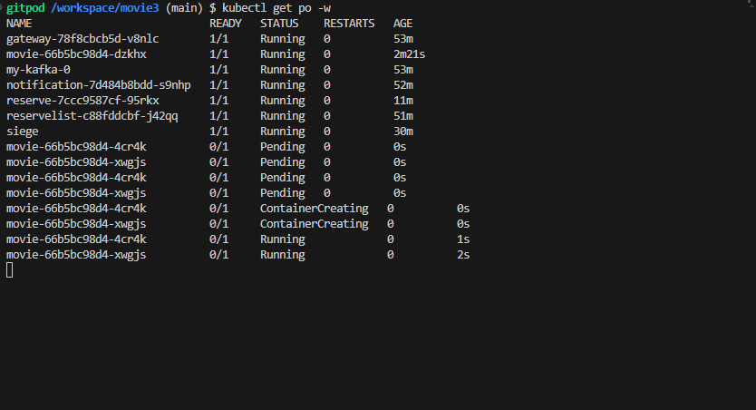
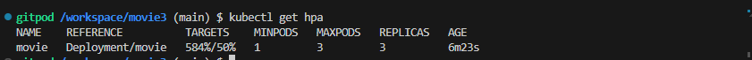


# 컨테이너로부터 환경분리 ConfigMap/Secret
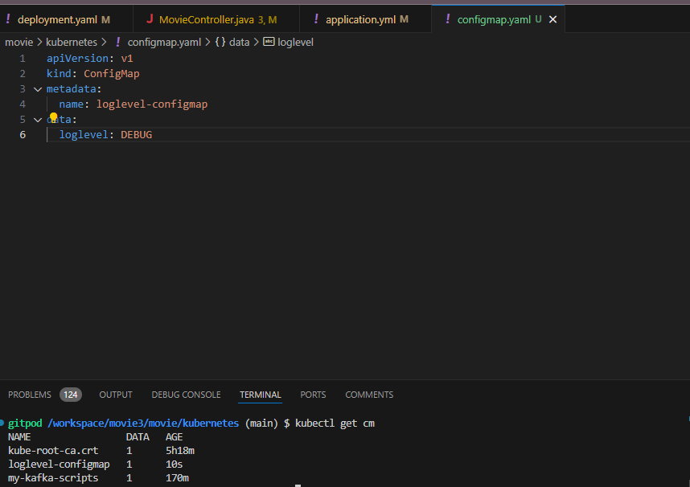
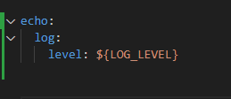
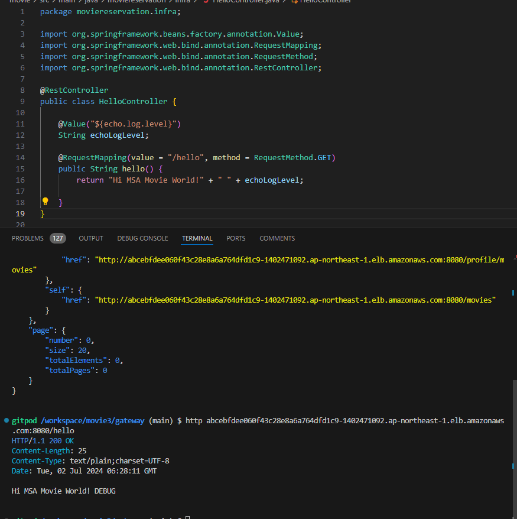


# 클라우드 스토리지 활용 PVC
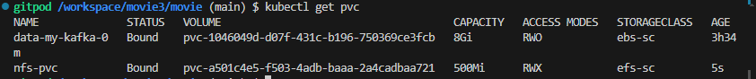
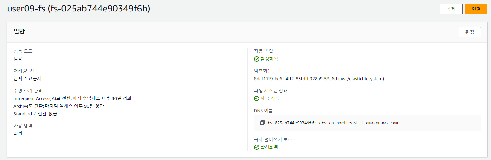

# 셀프힐링/무정지배포 - Liveness/Readness Probe
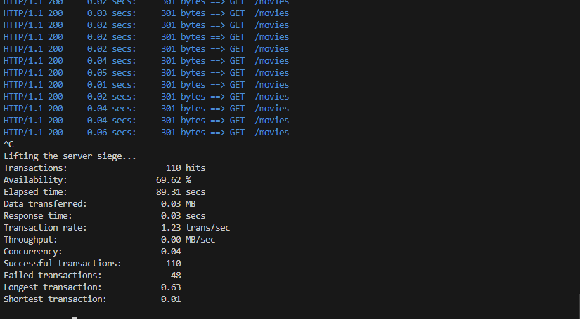
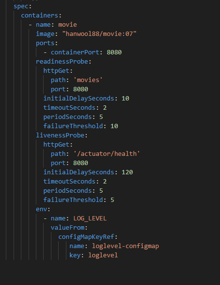
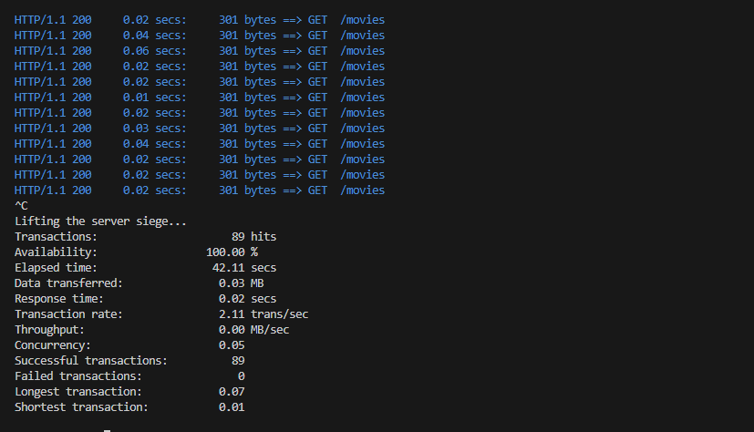


# 서비스메시 응용 - Mesh
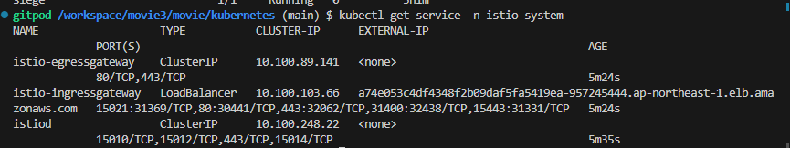
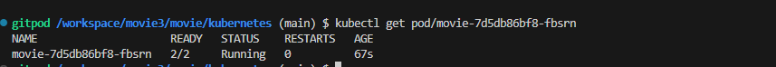


# 통합모니터링 Loggregation/Monitoring
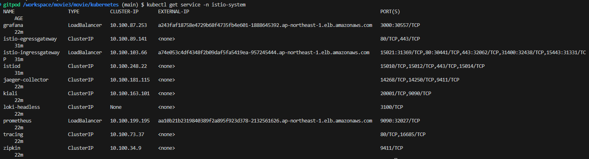
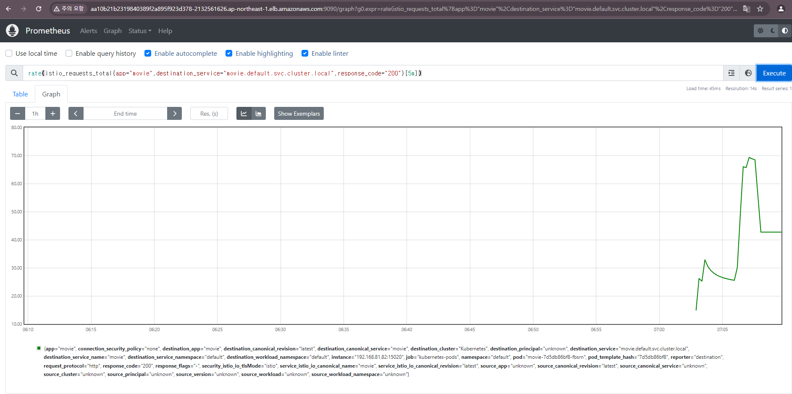